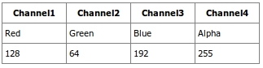
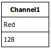
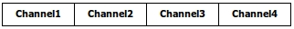
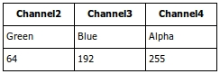
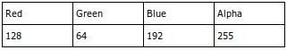
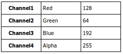
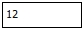
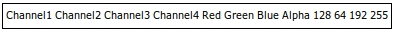
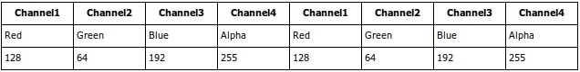
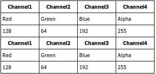

.. index:: single: QueryableTable

QueryableTable
==============

The purpose of the abstract class QueryableTable is to provide a way to
construct a table, and query the data in the cells. Right now, the table
can be queried by calling query functions to the table(ie. select),
however in the future it would be useful to have a query parser, which
would read in an SQL like query. This would allow for more readable
queries, as well as some query optimising.

Usage
-----

(The full working example can be found at MyQueryableTable_)

A class must first extend the QueryableTable class, and implement the
following methods:

.. code-block:: php

    abstract static function union_tables($tables);

    abstract static function join_tables($tables);

in most cases, the implementation should look something like this:

.. code-block:: php

    class MyQueryableTable extends QueryableTable {

        static function union_tables($tables){
            return QueryableTable::union_t($tables, "MyQueryableTable");
        }
        
        static function join_tables($tables){
            return QueryableTable::join_t($tables, "MyQueryableTable");
        }
    }

where the MyQueryableTable is the name of the class.

The class will also be needing a constructor. Because of the number of
different uses for the QueryableTable, the abstract class does not have
a constructor to populate any data, rather it is the responsibility for
the subclass to create constructors. A typical implementation might look
something like this:

.. code-block:: php

    function MyQueryableTable($structure, $matrix){
        global $myQueryableTableStructures;
        $this->id = "myqueryabletable".QueryableTable::$idCounter;
        $this->QueryableTable();
        $this->obj = $obj;
        if(is_array($structure)){
            $this->structure = $structure;
        }
        else{
            $this->structure = $this->preprocessStructure($myQueryableTableStructures[$structure]);
        }
        $this->errors = array();
        $this->xls = array();
        foreach($this->structure as $rowN => $row){
            foreach($row as $colN => $cell){
                if(isset($matrix[$rowN][$colN])){
                    $params = array();
                    $origCellValue = $matrix[$rowN][$colN];
                    if(!is_numeric($cell)){
                        $splitCell = explode('(', $cell);
                        $cell = $splitCell[0];
                        $params = explode(',', str_replace(', ', ',', str_replace(')', '', $splitCell[1])));
                    }
                    else if($origCellValue instanceof Cell && count($origCellValue->params) > 0){
                        $params = $origCellValue->params;
                    }
                    $cellValue = $this->processCell($cell, $params, $origCellValue, $rowN, $colN);
                    if(!($cellValue instanceof NACell)){
                        $this->xls[$rowN][$colN] = $cellValue;
                    }
                }
            }
        }
    }

Ok so that probably looks sort of confusing, but all that is happening is it is looping through the structure, and processing the values for the xls (data in the cells). Depending on how the data is retrieved, this constructor may look very different, for example, it could read from a spreadsheet, or it could access data from an object, or even call a web service somewhere, and parse the response.

*NOTE: The constructor is an area where there could probably be some cleanup, as right now it is pretty unclear on what constructors you need, and what all needs to be in it. The abstract class could probably be doing more of the work.*

Once the constructor is in place, you can create a new instance like this:

.. code-block:: php

    $table = new MyQueryableTable(MY_STRUCTURE, $data);
    echo $table->render();
    
Now you might be wondering where that MY_STRUCTURE comes from. That is a constant which would be used to define a specific structure for a table. An example would be something like this:

.. code-block:: php

    global $myQueryableTableStructures = array();
    define('MY_STRUCTURE', 1);
    $myQueryableTableStructures[NI_PUBLIC_PROFILE_STRUCTURE] =
        array(array(HEAD,HEAD,HEAD,HEAD),
              array(READ,READ,READ,READ),
              array(READ,READ,READ,READ)
        );
        
READ, HEAD etc. are all pre-defined Cell types. You can define your own cells by subclassing the abstract class Cell, and then defining them like this:

.. code-block:: php

    global $cellTypes;
    define('MY_CELL', 1000);
    $cellTypes[MY_CELL] = "MyCell";
    
Methods
-------

Just like you would with a database table, you can also run queries on a QueryableTable. One major difference however between an relational database table, and a QueryableTable is that the QueryableTable contains a structure in 2 dimensions, rather than the one dimension that relational databases would have.

Suppose we are using a QueryableTable with the same structure as mentioned above, and our data looks like the following:

.. code-block:: php

    $data = array(array("Channel1", "Channel2", "Channel3", "Channel4"),
                  array("Red", "Green", "Blue", "Alpha"),
                  array("128", "64", "192", "255"));
    $table = new MyQueryableTable(MY_STRUCTURE, $data);

Render
~~~~~~

The render methods returns an html representation of the table. An optional parameter is used to make the table sortable. If not specified, it defaults to not being sortable.

**Signature**

.. code-block:: php

    function render($sortable=false);
    
**Usage**

.. code-block:: php

    echo $table->render();
    
**Output**

    
Copy
~~~~

Copy is a very important method. Typically it will be used before you do any queries. Copy returns another instance of the table with the same data and structure.

**Signature**

.. code-block:: php

    function copy();
    
**Usage**

.. code-block:: php

    echo $table->copy()->render();
    
**Output**

    
Select
~~~~~~

Select applies a projection on the columns of the table. It will select columns with type $key, and with values equal to one of the $values.

**Signature**

.. code-block:: php

    function select($key, $values=array());
   
**Usage**

.. code-block:: php

    echo $table->copy()->select(HEAD, array("Channel1"))->render();
    
**Output**

.. _MyQueryableTable: https://github.com/UniversityOfAlberta/GrandForum/tree/master/extensions/QueryableTable/MyQueryableTable

Where
~~~~~

Where applies a selection to the rows of the table. It will select the rows with a cell of type $key, and whose value is equal to one of the $values.

**Signature**

.. code-block:: php

    function where($key, $values=array());
    
**Usage**

.. code-block:: php

    echo $table->copy()->where(HEAD, array("Channel1"))->render();
    
**Output**

Filtercols
~~~~~~~~~~

Filtercols removes the columns which have a cell of type $key, and whose value is equal to one of the $values.

**Signature**

.. code-block:: php

    function filterCols($key, $values=array());
    
**Usage**

.. code-block:: php

    echo $table->copy()->filterCols(HEAD, array("Channel1"))->render();
    
**Output**

Filter
~~~~~~

Filter removes the row which have a cell of type $key, and whose value is equal to one of the $values.

**Signature**

.. code-block:: php

    function filter($key, $values=array());
    
**Usage**

.. code-block:: php

    echo $table->copy()->filter(HEAD, array("Channel1"))->render();
    
**Output**

Limit
~~~~~

Limit will only show $amount number of rows, starting from $start

**Signature**

.. code-block:: php

    function limit($start, $amount);
    
**Usage**

.. code-block:: php

    echo $table->copy()->limit(0,2)->render();
    
**Output**

.. image:: _images/queryabletable/limit.jpeg

Limitcols
~~~~~~~~~

LimitCols will only show $amount number of columns, starting from $start

**Signature**

.. code-block:: php
    
    function limitCols($start, $amount);
    
**Usage**

.. code-block:: php

    echo $table->copy()->limitCols(0,2)->render();
    
Transpose
~~~~~~~~~

Transpose flips the rows and columns in the table.

**Signature**

.. code-block:: php

    function transpose();
    
**Usage**

.. code-block:: php

    echo $table->copy()->transpose()->render();
    
**Output**

Count
~~~~~

Counts the number of cells in the table, and returns a single celled table with the number of cells.

**Signature**

.. code-block:: php

    function count();
    
**Usage**

.. code-block:: php

    echo $table->copy()->count()->render();
    
**Output**

Concat
~~~~~~

Concatenates all the cell values in the table, and returns a single celled table containing the concatenated string.

**Signature**

.. code-block:: php

    function concat();
    
**Usage**

.. code-block:: php

    echo $table->copy()->concat()->render();
    
**Output**

Rasterize
~~~~~~~~~

Rasterize will transform all cells into simpler cell types. In most cases the cell types will remain the same as they are already in their simplest form, however an example of when a cell will change would be the ROW_SUM, and COL_SUM budget cell types. Rasterize will turn them into ROW_TOTAL, and COL_TOTAL respectively, resulting in a cell containing a number, rather than a cell containing the sum of other cells. Essentially, if there is a cell dependant to another one, rasterize will remove that dependency.

**Signature**

.. code-block:: php

    function rasterize();
    
**Usage**

.. code-block:: php

    echo $table->copy()->rasterize()->render();
    
**Output**

Join
~~~~

Join can be used to join two tables together side by side. If there is a different number of rows in each table, it will do it's best to figure out how to combine the two. If joining many tables together, it may be faster to use the static join_tables($tables) method, where $tables is the array of tables.

**Signature**

.. code-block:: php

    function join($table);
    
**Usage**

.. code-block:: php

    echo $table->copy()->join($table->copy())->render();
    
**Output**

Union
~~~~~

Union can be used to join two tables together one on top of the other. If there is a different number of columns in each table, it will do it's best to figure out how to combine the two. If unioning many tables together, it may be faster to use the static union_tables($tables) method, where $tables is the array of tables.

**Signature**

.. code-block:: php

    function union($table);
    
**Usage**

.. code-block:: php

    echo $table->copy()->union($table->copy())->render();
    
**Output**

