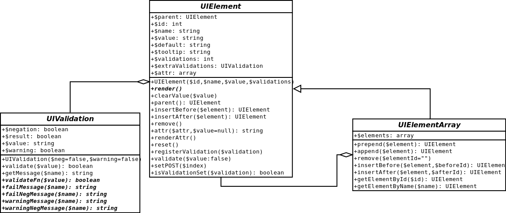
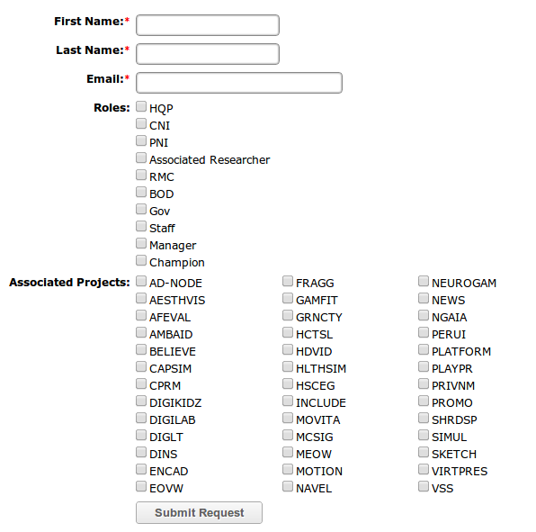

.. index:: single: UserInterface

UserInterface
=============

UI is an extension to help making forms easier to do and more consistent across other extensions. Form validation is done for each field, and many simple types are built in (like checking valid emails, null etc.). The way the functions are called is similar to how jQuery does calls. For example, append(), prepend(), remove() all work in virtually the same way as jQuery.

UML Diagram
-----------

Validations
-----------

Validations are done server side when the validate() function is explicitly called. Validations are added to UIElements either by using the built in validation constants, or by implementing a custom one. The built in validations use a bitfield integer during construciton ($validations) and when the constants are added together, all the validations will be run on that element. The custom constants, once implemented, can be added to a UIElement by calling the registerValidation($validation) function.

If an error is found in the validate() function, it is displayed to the UI and false is returned. If no errors occurred, but warnings did, the warnings are displayed with a yes/no question to the user whether or not they want to continue, false is returned, but once they press the 'yes' button true is returned. If there are no errors or warnings in the validation, then true is returned.

Example
-------

.. code-block:: php

    function createForm(){
        global $wgRoles, $wgUser;
        $me = Person::newFromUser($wgUser);
        $formContainer = new FormContainer("form_container");
            $formTable = new FormTable("form_table");

        $firstNameLabel = new Label("first_name_label", "First Name", "The first name of the user (cannot contain spaces)", VALIDATE_NOT_NULL);
        $firstNameField = new TextField("first_name_field", "First Name", "", VALIDATE_NOT_NULL);
        $firstNameRow = new FormTableRow("first_name_row");
        $firstNameRow->append($firstNameLabel)->append($firstNameField->attr('size', 20));

        $lastNameLabel = new Label("last_name_label", "Last Name", "The last name of the user (cannot contain spaces)", VALIDATE_NOT_NULL);
        $lastNameField = new TextField("last_name_field", "Last Name", "", VALIDATE_NOT_NULL);
        $lastNameField->registerValidation(new SimilarUserValidation(VALIDATION_POSITIVE, VALIDATION_WARNING));
        $lastNameField->registerValidation(new UniqueUserValidation(VALIDATION_POSITIVE, VALIDATION_ERROR));
        $lastNameRow = new FormTableRow("last_name_row");
        $lastNameRow->append($lastNameLabel)->append($lastNameField->attr('size', 20));

        $emailLabel = new Label("email_label", "Email", "The email address of the user", VALIDATE_NOT_NULL);
        $emailField = new EmailField("email_field", "Email", "", VALIDATE_NOT_NULL);
        $emailField->registerValidation(new UniqueEmailValidation(VALIDATION_POSITIVE, VALIDATION_WARNING));
        $emailRow = new FormTableRow("email_row");
        $emailRow->append($emailLabel)->append($emailField);

        $roleValidations = VALIDATE_NOT_NULL;
        if($me->isRoleAtLeast(MANAGER)){
            $roleValidations = VALIDATE_NOTHING;
        }
        $roleOptions = array();
        foreach($wgRoles as $role){
                if($me->isRoleAtLeast($role) && $role != CHAMP){
                    $roleOptions[] = $role;
                }
            }
            if($me->isRoleAtLeast(CNI)){
                $roleOptions[] = CHAMP;
            }
        $rolesLabel = new Label("role_label", "Roles", "The roles the new user should belong to", $roleValidations);
        $rolesField = new VerticalCheckBox("role_field", "Roles", array(), $roleOptions, $roleValidations);
        $rolesRow = new FormTableRow("role_row");
        $rolesRow->append($rolesLabel)->append($rolesField);

        $projects = Project::getAllProjects();
        $projectOptions = array();
        foreach($projects as $project){
            $projectOptions[] = $project->getName();
        }
        $projectsLabel = new Label("project_label", "Associated Projects", "The projects the user is a member of", VALIDATE_NOTHING);
        $projectsField = new MultiColumnVerticalCheckBox("project_field", "Associated Projects", array(), $projectOptions, VALIDATE_NOTHING);
        $projectsRow = new FormTableRow("project_row");
        $projectsRow->append($projectsLabel)->append($projectsField);

        $submitCell = new EmptyElement();
        $submitField = new SubmitButton("submit", "Submit Request", "Submit Request", VALIDATE_NOTHING);
        $submitRow = new FormTableRow("submit_row");
        $submitRow->append($submitCell)->append($submitField);

        $formTable->append($firstNameRow)
                  ->append($lastNameRow)
                  ->append($emailRow)
                  ->append($rolesRow)
                  ->append($projectsRow)
                  ->append($submitRow);

        $formContainer->append($formTable);
        return $formContainer;
    }
    
When rendered, this will result in a form that looks like: 

